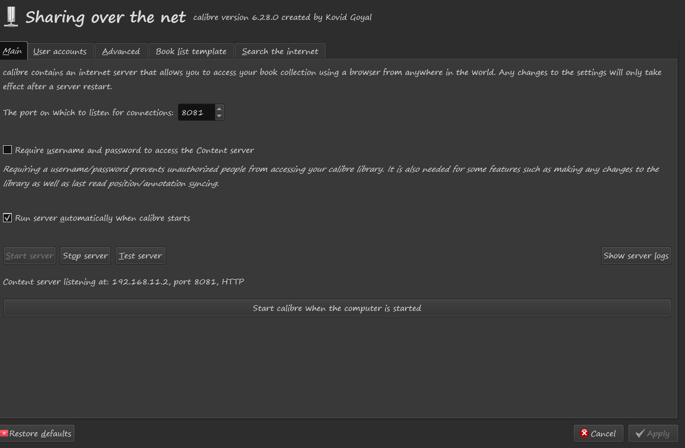
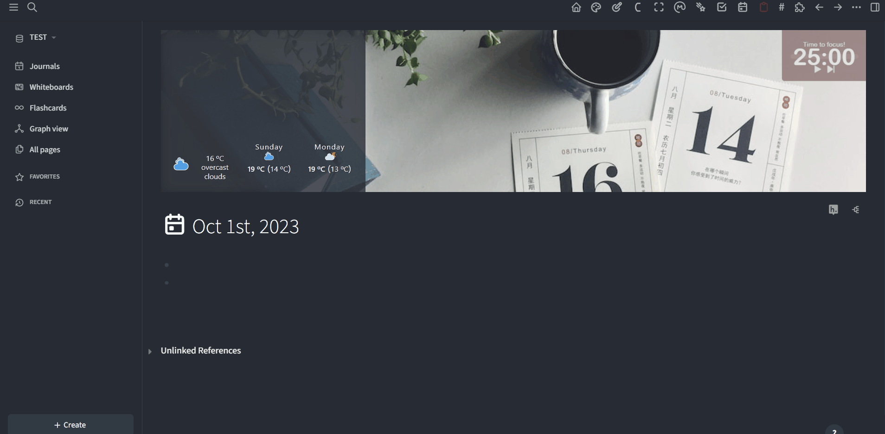
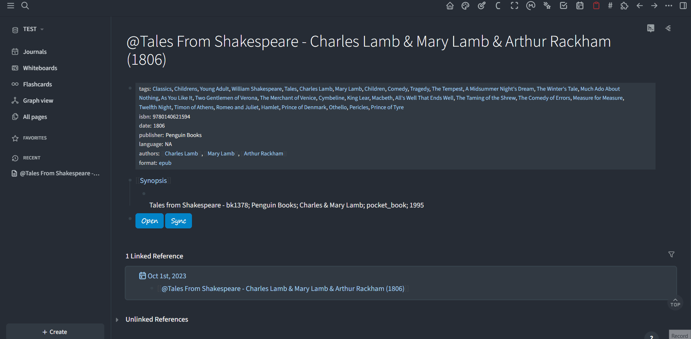

## ⚠️ Warning

**This plugin has been deprecated. Its functionality has now been incorporated into the [`calibreAnnotation` ](https://github.com/duydl/logseq-calibre-annotation)plugin.**

# Logseq Calibre Plugins

- calibreMetadata
https://github.com/duydl/logseq-calibre-metadata

- calibreAnnotation
https://github.com/duydl/logseq-calibre-annotation

Enhance your note-taking experience with Logseq by integrating it with [Calibre](https://calibre-ebook.com/), a robust e-book management software. These plugins utilize Calibre's Server API to provide a seamless e-book reading and note-taking experience within Logseq.

These two plugins can function independently. The `calibreMetadata` plugin only inserts the macros used by the `calibreAnnotation` plugin. 

Without `calibreMetadata`, you can still manually create links to your books. 

Without `calibreAnnotation`, you'll have a block with two non-functional renderer macros after creating page.

- Calibre Content Server is a very convenient tool. Add annotations to your books in a browser or on any other device, and the annotations will seamlessly sync to the page.

## Usage

To start using these plugins, you'll need to start the Content server of Calibre. 
You could configure Calibre to start the server automatically. 

The `calibreMetadata` plugin allows you to import Calibre metadata and generate a dedicated page for taking notes.

You'll first need to specify the name of the library where you store the books you want to import. Other settings can be left at their default values, but feel free to customize them to your preference.

## Future Enhancements

- Add support for more user-defined metadata. 
- Add options for authentication. 

## License